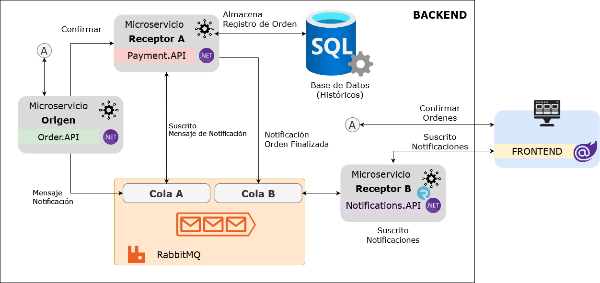

# Open Telemetry

Tema: Telemetría, registro de eventos y rastreo con .NET Core 
## **Conocimientos previos**  
* C#
* Conocimientos básicos de programación orientada a objetos
* Conocimientos básicos de Docker

## **Demos**  
* [01 - Aplicación de Ordenes / Azure Insights](demo1)
* [02 - Aplicación de Ordenes / Open Telemetry - Jaeger](demo2)
* [03 - Aplicación de Ordenes / Open Telemetry - Prometheus / Grafana](demo3)

# Arquitectura

